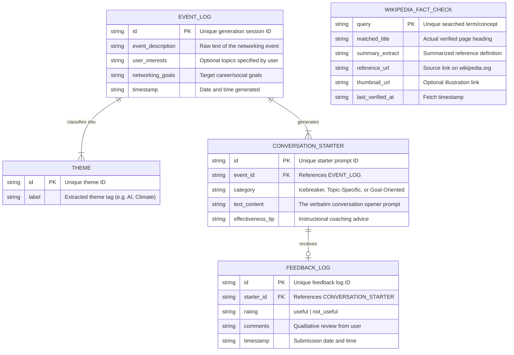

# Entity-Relationship Diagram (ERD)
### Personalized Networking Assistant

The database architecture is designed to support structured tracking of networking events, generated conversation openings, and user feedback logs to reinforce progressive learning and personalized AI responses.

Below is the Mermaid representation of the ER diagram. You can paste this directly into any markdown viewer (like VS Code's markdown preview, GitHub, or Mermaid Live Editor) to render it visually.

### Description of Entities and Fields

1. **EVENT_LOG**
   - Stores the key contextual metadata of each analyzed networking session. Keeps track of the input description, user interests, and desired outcome goals to rebuild past sessions on-demand.

2. **THEME**
   - Zero-shot classified tags (like *Blockchain*, *Healthcare*, or *Sustainability*) extracted from the event context. Enables indexing and search filtering on past session topics.

3. **CONVERSATION_STARTER**
   - The specific conversational lines generated by the GPT-2/Gemini text generator model, categorized by social opener styles (e.g., Icebreaker). Linked to its originating event context.

4. **FEEDBACK_LOG**
   - Logs thumbs-up (useful) and thumbs-down (not useful) evaluations along with qualitative user reviews. This table feeds reinforcement training runs to optimize future generated context alignment.

5. **WIKIPEDIA_FACT_CHECK**
   - Cache of real-time verified pages fetched through the MediaWiki REST APIs. Eliminates redundant external HTTP requests for frequently checked terms (e.g. *smart grids*, *fintech*).
